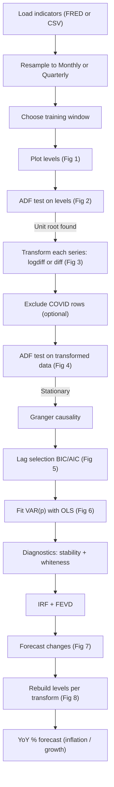
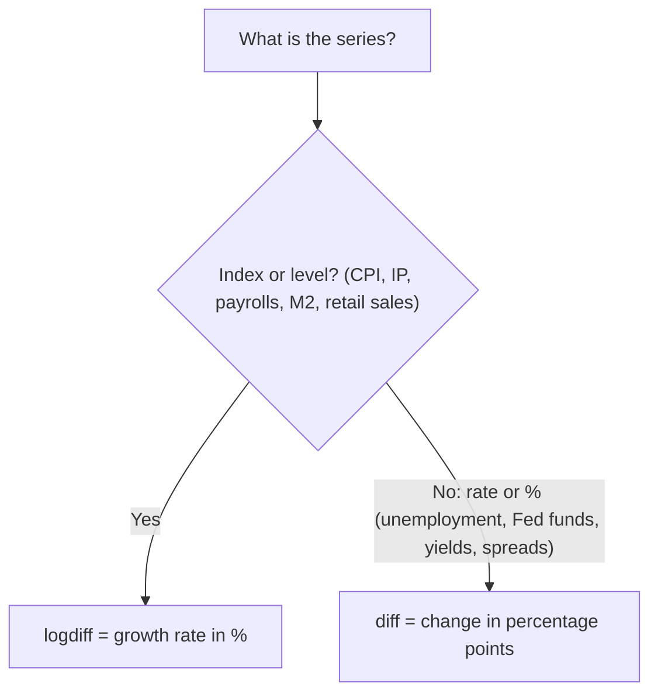
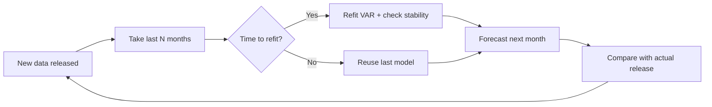
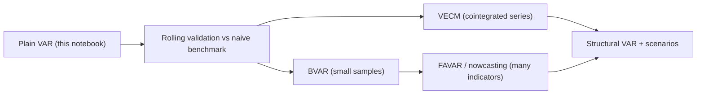

# VAR Model Workflow: Macroeconomic Forecasting

A Jupyter notebook (`VAR_MACRO.ipynb`) that builds a **VAR (Vector Autoregression)** on 3-5 macro indicators (for example CPI, unemployment, industrial production, Fed funds rate) and forecasts them 12 months (or 4 quarters) ahead.

It follows the same workflow as the WorldQuant "VAR Model Application" and my HTF/STF notebooks, adapted for macro data.

---

## 1. What is VAR? (simple)

Each indicator is predicted using **its own past** and **the past of the other indicators**.

```
Inflation now     = a + b1 * inflation past + b2 * unemployment past + b3 * rate past + error
Unemployment now  = c + d1 * inflation past + d2 * unemployment past + d3 * rate past + error
Rate now          = e + f1 * inflation past + f2 * unemployment past + f3 * rate past + error
```

It answers: *how do macro variables move together, and what do they say about the next few months?*

---

## 2. Big Picture Flow



---

## 3. Cell-by-Cell Guide

| Cell | What it does | What to look for |
|---|---|---|
| 1 | Imports | `arch` installs itself if missing |
| 2 | Config + data loading | Printed last date per series and obs count |
| 3 | Plot levels (Fig 1) | Trending series = not stationary |
| 4 | ADF on levels (Fig 2) | `Stationary = False` is expected |
| 5 | Transform + ADF (Fig 3, 4) | `Stationary = True` is needed to continue |
| 6 | Granger causality | `p < 0.05` = past of X helps predict Y |
| 7 | Lag selection (Fig 5) | Chosen lag is printed |
| 8 | Fit VAR(p) (Fig 6) | Significant coefficients have `p < 0.05` |
| 9 | Stability + whiteness | Stable = True, whiteness p > 0.05 |
| 10 | IRF + FEVD | Shock spread between variables (1 year) |
| 11 | Forecast of changes (Fig 7) | Confidence band grows with horizon |
| 12 | Forecast of levels (Fig 8) | Each series rebuilt with its own transform |
| 13 | YoY % forecast | The way inflation and growth are read |

Optional: save screenshots and add them here.

```


```

---

## 4. How Macro Differs from Trading Data

| Topic | Trading (HTF/STF) | Macro (this notebook) |
|---|---|---|
| Transform | Log difference for all | **Per series:** `logdiff` or `diff` |
| ADF trend | `"n"` | `"c"` (series have non-zero means) |
| Data size | 500-3000+ bars | 100-400 obs only |
| Lag selection | AIC (HTF), BIC (STF) | BIC (few obs, avoid overfitting) |
| Frequency | 4H to Monthly, intraday | Monthly or Quarterly |
| Special step | Session gap masking (STF) | COVID exclusion, YoY view |
| Data source | CSV / yfinance | FRED (free, no key) or CSV |

### Which transform to use?



- **logdiff** is `100 * (log(x_t) - log(x_t-1))`, the % change. Rebuilt with `exp(log(last) + cumsum/100)`.
- **diff** is `x_t - x_t-1`. Rebuilt with `last + cumsum`.
- Rates can be near zero or negative, so log does not work for them.

---

## 5. Settings to Edit (Cell 2)

```python
DATA_SOURCE = "fred"          # 'fred' or 'csv'
FREQ = "M"                    # 'M' monthly | 'Q' quarterly
TRAINING_DATA_MODE = "full"   # 'full' | 'recent_years' | 'custom_range'
TRAIN_YEARS = 25              # used if 'recent_years'
EXCLUDE_COVID = True          # drops 2020-03 to 2021-06 from modelling
LAG_CRITERION = "bic"         # 'aic' | 'bic' | 'hqic' | 'fpe'

INDICATORS = [
  {"alias": "CPI", "fred_id": "CPIAUCSL", "csv_file_path": "...", "csv_column": "CPI", "transform": "logdiff"},
  {"alias": "UNRATE", "fred_id": "UNRATE", ..., "transform": "diff"},
]
```

**CSV format:** a date column (`date`, `observation_date`, ...) and a value column named in `csv_column`.
**FRED loader:** downloads `fredgraph.csv?id=<fred_id>` directly, so it needs an internet connection.
**Frequency rule:** the source data must be as fine or finer than `FREQ`. For example, GDP (quarterly) needs `FREQ="Q"`.

---

## 6. Which Indicators Can Be Predicted?

| Indicator | FRED ID (US) | Transform | Freq | Comment |
|---|---|---|---|---|
| CPI inflation | `CPIAUCSL` | logdiff | M | Works well, read as YoY |
| Core CPI | `CPILFESL` | logdiff | M | Smoother than headline |
| PCE inflation | `PCEPI` | logdiff | M | Fed's preferred measure |
| Unemployment rate | `UNRATE` | diff | M | Slow and persistent |
| Industrial production | `INDPRO` | logdiff | M | Monthly growth proxy |
| Nonfarm payrolls | `PAYEMS` | logdiff | M | Jobs growth |
| Retail sales | `RSAFS` | logdiff | M | Consumer demand |
| Fed funds rate | `FEDFUNDS` | diff | M | Step-like, use carefully |
| 10Y yield / 10Y-2Y spread | `GS10`, `T10Y2Y` | diff | M | Daily data, month-end resample |
| M2 money supply | `M2SL` | logdiff | M | Weak link to inflation |
| Consumer sentiment | `UMCSENT` | diff | M | Noisy |
| Housing starts | `HOUST` | logdiff | M | Volatile |
| Oil price | `DCOILWTICO` | logdiff | M | Mostly an input, hard to predict |
| USD/INR | `DEXINUS` | logdiff | M | FX is hard to predict |
| Real GDP | `GDPC1` | logdiff | Q | ~130 obs, use 2-3 variables max |

**Best targets:** persistent series (unemployment, inflation, industrial production, yields).
**Poor targets:** oil, FX, sentiment. Use them as inputs, not as things to forecast.
**India:** use CSV from RBI DBIE or MOSPI (CPI, IIP, repo rate) with `DATA_SOURCE="csv"`. Check any FRED India series ID and its last update date before using it.

---

## 7. How to Read the Results

- **ADF test:** null hypothesis is "unit root (not stationary)". If `ADF stat < 5% critical value`, the series is stationary. Levels should fail and transformed data should pass.
- **Granger causality:** `p < 0.05` at a lag means the past of X helps predict Y. It shows predictive help, not real cause and effect.
- **Lag selection:** BIC picks fewer lags than AIC, which is safer with small samples.
- **VAR summary:** look at coefficient p-values. Many will be insignificant, and that is normal.
- **Stability:** all roots inside the unit circle (`is_stable = True`). If not, forecasts can explode.
- **Whiteness:** `p > 0.05` is good. A low p-value means the model missed a pattern, so try more lags.
- **IRF:** "if the rate rises by 1 unit today, how do inflation and unemployment react over the next 12 months?" The effect should fade toward zero.
- **FEVD:** "what share of inflation's forecast uncertainty comes from rate shocks vs its own?"
- **Level forecast:** usually a smooth path that drifts toward the average growth rate. Do not expect turning points.
- **YoY %:** the practical view for inflation and growth (for example "CPI YoY ~2.8% in 6 months").

---

## 8. Key Design Choices

1. **Transform depends on the series,** not a single log-diff for everything.
2. **`SCALE = 100`:** growth rates are in % so they are comparable with rate changes in percentage points.
3. **COVID rows are excluded from modelling only.** The last actual levels are still used to rebuild forecasts.
4. **The shortest series limits the sample.** Series are published with different lags, and the notebook prints the last date of each.
5. **Whiteness test uses `p + 12` lags (monthly) or `p + 4` (quarterly),** which is one year of residual lags.

---

## 9. Static vs Rolling

The notebook fits **one model once**. To check whether it has real forecasting value, use a rolling (walk-forward) test:

```python
WINDOW, REFIT_EVERY, p = 240, 3, optimal_lag   # 20 years of months, refit quarterly
preds, actual = [], []
for t in range(WINDOW, len(diff_data)):
    if (t - WINDOW) % REFIT_EVERY == 0:
        res = VAR(diff_data.iloc[t - WINDOW:t]).fit(p, trend="c")
    preds.append(res.forecast(diff_data.values[t - p:t], steps=1)[0])
    actual.append(diff_data.values[t])

preds = pd.DataFrame(preds, index=diff_data.index[WINDOW:], columns=diff_data.columns)
actual = pd.DataFrame(actual, index=diff_data.index[WINDOW:], columns=diff_data.columns)
rmse_var = ((preds - actual) ** 2).mean() ** 0.5
rmse_naive = (actual ** 2).mean() ** 0.5        # "no change" benchmark
print(pd.concat([rmse_var, rmse_naive], axis=1, keys=["VAR", "Naive"]))
```



If VAR does not beat the **naive benchmark**, there is no edge. Macro VARs usually help at **1-6 month** horizons, not further out.

---

## 10. Limitations

- Small samples: each extra variable or lag uses a lot of data. Keep 3-5 variables.
- Regime changes (zero-rate years, 2022 hikes, COVID) change the coefficients. Consider `recent_years`.
- Data is revised after release, so real-time forecasting needs vintage data (ALFRED).
- VAR is linear and assumes stable relationships.
- Yields of different maturities are usually cointegrated. Differencing loses that long-run link, so test with Johansen and consider a VECM.
- Level forecasts flatten out because the model only captures average dynamics.

**Next steps:** rolling validation, VECM, adding an exogenous variable (oil, dollar index), BVAR for larger systems.

---
## 11. Do Banks Use This in Real Life?

Yes, but mostly in improved forms, and rarely as the only model.

### Where VAR is used

- **Central banks and research desks** (Fed, ECB, BoE and others) use VARs as a baseline forecast and to study how shocks spread. That is what IRF and FEVD do. Christopher Sims won a Nobel Prize in 2011 for this line of work.
- **Bank economics teams** use it for quick short-horizon views on inflation, rates and growth, and as a sanity check on their main forecast.
- **Stress testing:** scenarios such as "unemployment rises 4 points" are extended across GDP, rates and house prices using VAR-type models. The projections then feed credit-loss models.

### What is used instead of a plain VAR

| Problem with plain VAR | Upgrade used in practice |
|---|---|
| Too many parameters for few data points | **BVAR** (Bayesian VAR) shrinks coefficients toward simple behaviour |
| Only 3-5 variables possible | **FAVAR / factor models** compress 100+ indicators into a few factors |
| Shock ordering is arbitrary (Cholesky in IRF) | **Structural VAR** uses economic theory to identify shocks |
| Relationships change over time | **Time-varying parameter VAR** |
| Yields and rates move together long-run | **VECM** |
| Data is released with a delay | **Nowcasting** (dynamic factor models) |
| Needs an economic story | **DSGE / semi-structural models** (central banks use these for the main policy forecast) |

### Learning path



### Reality check

- Final forecasts usually mix several models plus **human judgement**, not one VAR output.
- Simple VARs are good baselines but do not predict turning points such as recessions.
- Banks care more about **scenarios and risk** ("what if rates jump 2%?") than a single point forecast.
- Knowing VAR well, how to validate it, and why it fails is a strong foundation. The next steps are **BVAR, VECM and FAVAR**.
- 
## 11. Common Errors

| Error | Fix |
|---|---|
| `ValueError: ... is coarser than FREQ` | Use `FREQ="Q"` for GDP, or drop the quarterly series |
| `KeyError: '<column>' not in ...` | Fix `csv_column` to match the CSV header |
| FRED download fails | Check internet and `fred_id`, or use `DATA_SOURCE="csv"` |
| Sample much shorter than expected | One series has a short history or late release. Check the printed last dates |
| Lag selection error or `< 100 obs` warning | Use fewer variables, lower `MAX_LAGS`, or a longer window |
| `is_stable = False` | Use fewer lags, remove a variable, or change the window |
| Whiteness p-value is low | Increase lags or add a missing variable |
| `!pip install arch` fails | Run `pip install arch` in the terminal |

---

## 12. Glossary

- **Stationary:** mean and variance stay roughly constant over time.
- **Unit root:** a random-walk-like series, not stationary.
- **logdiff:** log growth rate, `100 * (log(x_t) - log(x_t-1))`, approximately the % change.
- **YoY:** year-over-year % change.
- **Lag:** how many past months (or quarters) the model uses.
- **BIC/AIC:** scores to pick the lag. Lower is better, and BIC penalises complexity more.
- **IRF:** impulse response, the effect of a one-time shock over time.
- **FEVD:** forecast error variance decomposition, the source of forecast uncertainty.
- **Cointegration:** non-stationary series that move together in the long run.
- **Vintage data:** data as it was first released, before revisions.
