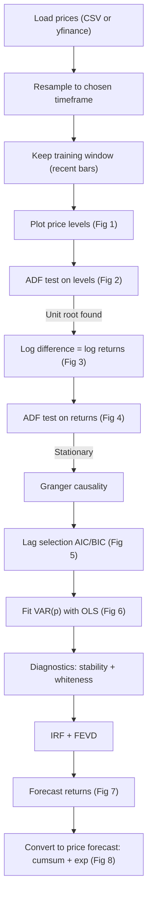
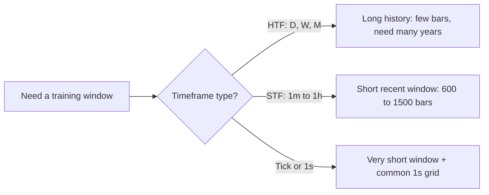
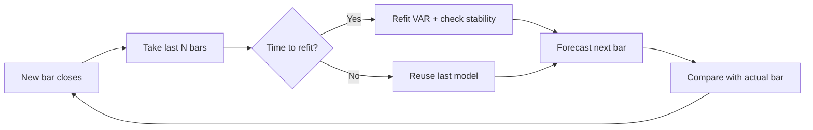

# VAR Model Workflow: HTF and STF

Two Jupyter notebooks that build a **VAR (Vector Autoregression)** model on 2 or 3 financial time series (for example NAS100 and SPX500). They follow the WorldQuant "3. VAR Model Application" workflow.

| Notebook | Timeframes | Idea |
|---|---|---|
| `VAR_HTF.ipynb` | 4H, Daily, Weekly, Monthly | Use **more** history because there are few bars |
| `VAR_STF.ipynb` | Tick, 1s, 1m, 5m, 15m, 1h | Use **less, recent** data because intraday behaviour changes fast |

---

## 1. What is VAR? (simple)

Each series is predicted using **its own past** and **the past of the other series**.

```
NAS100 return now = a + b1 * NAS100 past + b2 * SPX500 past + error
SPX500 return now = c + d1 * NAS100 past + d2 * SPX500 past + error
```

It answers: *does one market lead the other, and can that help forecast?*

---

## 2. Big Picture Flow



---

## 3. Cell-by-Cell Guide

| Cell | What it does | Why | What to look for |
|---|---|---|---|
| 1 | Imports | Load libraries | `arch` installs itself if missing |
| 2 | Config + data loading | One place to change settings | Check printed bar count and date range |
| 3 | Plot price levels (Fig 1) | See trends visually | Trending prices = not stationary |
| 4 | ADF on levels (Fig 2) | Test for unit root | `Stationary = False` is expected |
| 5 | Log difference + ADF (Fig 3, 4) | Make data stationary | `Stationary = True` is needed to continue |
| 6 | Granger causality | Does A help predict B? | `p-value < 0.05` means yes at that lag |
| 7 | Lag selection (Fig 5) | Choose how many past bars to use | Chosen lag is printed |
| 8 | Fit VAR(p) (Fig 6) | Estimate coefficients | Significant coefficients have `p < 0.05` |
| 9 | Stability + whiteness | Is the model valid? | Stable = True, whiteness p > 0.05 |
| 10 | IRF + FEVD | How shocks spread between series | See section 6 |
| 11 | Forecast of returns (Fig 7) | Forecast with confidence band | Usually flat (returns are hard to predict) |
| 12 | Forecast of prices (Fig 8) | Turn return forecast into price | Usually a flat or slightly sloped line |

### Save screenshots (optional)

```


```

---

## 4. HTF vs STF

| Setting | HTF | STF |
|---|---|---|
| Timeframes | 4H, D, W, M | tick, 1s, 1m, 5m, 15m, 1h |
| Training window (bars) | 4H: 3000, D: 2500, W: 520, M: 240 | tick/1s: 3600, 1m: 1500, 5m: 1000, 15m: 800, 1h: 600 |
| Max lags | 12 / 12 / 8 / 6 | 10 (1h: 8) |
| Lag criterion | AIC | BIC (fewer lags, safer on short data) |
| Session gap masking | No (gaps are normal) | Yes (gap > 3 bars is masked) |
| Forward-fill | No | Only tick/1s, max 10 bars |
| Forecast time step | 4H: +4h, D: business day, W: Friday, M: month-end | +1 bar |
| yfinance | 4H (via 1h), D, W, M | 1m (7 days), 5m/15m (60 days), 1h (730 days). No tick/1s |

### Why less data for intraday?
Intraday relationships change with the session (Asia, London, New York) and with volatility. Old data from last month may describe a different market. A short recent window keeps the coefficients relevant.
Do not go too small: keep at least **~500 bars**.



---

## 5. Settings to Edit (top of each notebook)

```python
DATA_SOURCE = "csv"                 # 'csv' or 'yfinance'
TIMEFRAME = "D"                     # HTF: 4H D W M | STF: tick 1s 1m 5m 15m 1h
TRAINING_DATA_MODE = "recent_bars"  # 'recent_bars' | 'full' | 'custom_range'
LAG_CRITERION = "aic"               # 'aic' | 'bic' | 'hqic' | 'fpe'
INSTRUMENTS = [ {alias, yf_ticker, csv_file_path, csv_column}, ... ]
```

Only change `TIMEFRAME` and the config. Everything else runs automatically.

**CSV format:** needs a date column (`date`, `datetime`, `time`, `timestamp`) and a price column (`Close`, `price`, `last`, or `bid` for ticks). The code finds them automatically. The CSV must be **as fine or finer** than your chosen timeframe. For example, a daily CSV cannot be used for 4H.

---

## 6. How to Read the Results

- **ADF test:** Null hypothesis = "has a unit root (not stationary)". If `ADF stat < 5% critical value`, the series is stationary. Levels should fail and log returns should pass.
- **Granger causality:** `p < 0.05` at a lag means the past of X helps predict Y. It shows predictive help, not real cause and effect.
- **Lag selection:** AIC picks more lags, BIC picks fewer. On short windows prefer BIC.
- **VAR summary:** Look at coefficient p-values. Many will be insignificant, and that is normal for returns.
- **Stability:** All roots must be inside the unit circle (`is_stable = True`). If not, the forecasts can explode.
- **Whiteness (residual test):** `p > 0.05` is good (no leftover pattern). A low p-value means try more lags.
- **IRF (impulse response):** "If NAS100 gets a 1-unit shock today, how does SPX500 react over the next bars?" The effect should fade to zero.
- **FEVD:** "What share of SPX500's forecast uncertainty comes from NAS100 shocks vs its own?"
- **Forecasts:** Flat forecasts are normal because return predictability is tiny. Do not expect a trend.

---

## 7. Key Design Choices

1. **Log difference, not price difference.** This matches the WorldQuant application, and prices are rebuilt with `exp(last_log + cumsum)`.
2. **Session gaps are masked in STF.** Overnight and weekend jumps are not real 1-minute returns and would corrupt the VAR.
3. **Modelling data is the same data that was gap-cleaned.** ADF, Granger, and VAR all use `diff_data`.
4. **Forecast uses the last `p` rows** of the returns (`diff_data.values[-p:]`).

---

## 8. This is Static. For Live Trading Add Rolling

The notebooks fit **one model once**. Live trading needs a walk-forward loop:

```python
WINDOW, REFIT_EVERY, p = 1000, 20, optimal_lag
preds, actual = [], []
for t in range(WINDOW, len(diff_data)):
    if (t - WINDOW) % REFIT_EVERY == 0:
        res = VAR(diff_data.iloc[t - WINDOW:t]).fit(p, trend="c")
    preds.append(res.forecast(diff_data.values[t - p:t], steps=1)[0])
    actual.append(diff_data.values[t])
```



- Re-run ADF, Granger, and lag selection **daily or weekly**, not every bar.
- Always compare with the **zero-forecast benchmark**. If VAR can't beat it out-of-sample, there is no edge.

---

## 9. Limitations

- Return predictability is very small, and level forecasts usually go flat.
- Tick and 1s data have noise (bid-ask bounce). Forward-filling adds a small bias toward zero.
- The forecast time index in STF does not skip session close.
- No transaction costs or slippage in this workflow.
- VAR is linear and assumes stable relationships.

**Next steps:** rolling validation, VECM (if the series are cointegrated), GARCH for volatility, cost-aware backtest.

---

## 10. Common Errors

| Error | Fix |
|---|---|
| `KeyError: No date column` | Rename the CSV date header to `date` or `datetime` |
| `ValueError: source data is coarser` | Use a finer CSV or a coarser `TIMEFRAME` |
| `yfinance has no tick/1s data` | Use `DATA_SOURCE = "csv"` |
| Empty data after loading | The instruments have no overlapping timestamps. Check the files |
| Lag selection error or few bars | Lower `MAX_LAGS` or use more data |
| `is_stable = False` | Use fewer lags or a different window |
| `!pip install arch` fails | Run `pip install arch` in the terminal |

---

## 11. Glossary

- **Stationary:** mean and variance stay roughly constant over time.
- **Unit root:** a random-walk-like series, not stationary.
- **Log return:** `log(price_now) - log(price_before)`.
- **Lag:** how many past bars the model looks at.
- **AIC/BIC:** scores to pick the lag. Lower is better, and BIC penalises complexity more.
- **Ergodic/stable:** shocks fade out over time.
- **Cointegration:** two non-stationary series that move together in the long run.
